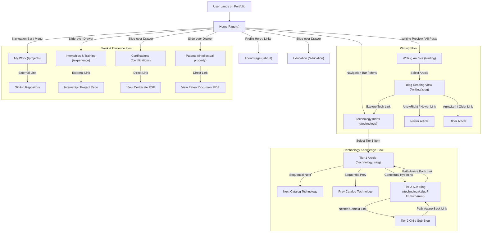

# Vaibhav Gupta — Personal Portfolio & Technical Knowledge Base

> An engineering-focused personal portfolio, technical writing platform, and interconnected knowledge base built with Next.js 16 (App Router), TypeScript, and Tailwind CSS.

[](https://vaibhav19.vercel.app/)
[](https://nextjs.org/)
[](https://react.dev/)
[](https://www.typescriptlang.org/)
[](https://tailwindcss.com/)
[](#license)

**Live Production Site**: [https://vaibhav19.vercel.app/](https://vaibhav19.vercel.app/)

---

## Table of Contents

- [Overview](#overview)
- [Key Features](#key-features)
- [Architecture Overview](#architecture-overview)
- [Architectural Diagram](#architectural-diagram)
- [Application & Navigation Flow](#application--navigation-flow)
- [Content & Blog Network Architecture](#content--blog-network-architecture)
- [Repository Structure](#repository-structure)
- [Design System & Aesthetics](#design-system--aesthetics)
- [Key Architectural Decisions](#key-architectural-decisions)
- [Tech Stack](#tech-stack)
- [Local Development](#local-development)
- [Deployment](#deployment)
- [Content Maintenance Guide](#content-maintenance-guide)
- [Accessibility & Responsiveness](#accessibility--responsiveness)
- [License](#license)

---

## Overview

This repository contains the production source code for the personal portfolio, engineering records, and technical knowledge base of **Vaibhav Gupta** ([@vaibhv19](https://github.com/vaibhv19)), deployed live at [vaibhav19.vercel.app](https://vaibhav19.vercel.app/).

Rather than functioning as a superficial developer landing page or static resume, the application is designed around two foundational goals:

1. **Evidence-Grounded Engineering Showcase**: Presenting software engineering capabilities through concrete project implementations, architectural retrospectives, formal credentials, registered patents, and active contributions rather than unsupported skill badges.
2. **Two-Tier Interconnected Knowledge Network**: Operating a dual-system publishing platform that cleanly separates high-level reflective writing from an interconnected, multi-tier technology knowledge base with contextual concept hyperlinks.

The site is built with **Next.js 16 (App Router)** and **React 19**, compiled to static pages with route-level metadata, deterministic ordering, custom keyboard navigation, and responsive typography.

---

## Key Features

- **Dark Editorial Aesthetic**: Deep midnight background (`#0a0d14`), Syne variable typography, warm copper accent highlights (`#E8913A`), and cyan contextual hyperlinks (`#38bdf8`) inspired by the contrast and texture of Vincent van Gogh's midnight palettes.
- **Two Distinct Content Engines**:
  - **Writing System (`/writing`)**: Chronological archive of 14 long-form technical essays covering architectural decisions, multi-language distributed caches, agent sandboxes, and engineering philosophy.
  - **Technology Knowledge System (`/technology`)**: Structured catalog of 45+ technologies and engineering concepts across 8 categories with practical notes and project cross-references.
- **Two-Tier Concept Hyperlinking**:
  - **Tier 1 (Catalog Articles)**: Publicly indexed technology notes with sequential prev/next footer navigation matching catalog hierarchy.
  - **Tier 2 (Sub-Blogs / Concept Deep-Dives)**: Hidden specialized articles (e.g., *Hybrid RAG*, *BM25*, *Cross-Encoder Reranking*, *Web Workers & WebAssembly*) discovered exclusively via inline contextual links, featuring dynamic `?from=` referrer back-navigation.
- **Work Showcase with Parent Frameworks (`/projects`)**: 6 curated project categories supporting hierarchical grouping (e.g., IBM PBEL, Lenovo LEAP) with bulleted technical summaries and GitHub repository links.
- **Live GitHub Contribution Graph (`/about`)**: Custom-rendered activity grid backed by an automated 3-tier cascade: server-side GitHub GraphQL API &rarr; tokenless public REST endpoint &rarr; deterministic offline fallback generator.
- **Direct PDF Credential & Patent Integration**: In-browser viewing links for official university certifications (IIT Kanpur, NPTEL) and registered Indian Patent Office design documentation (`/patent/452200-001`).
- **Keyboard-Driven Article Traversal**: Global `ArrowLeft` and `ArrowRight` hotkeys on all writing and technology reading pages with automatic form-field input suppression.
- **Accessible Slide-Over Navigation**: Full-screen slide-over drawer with backdrop blur, Starry Night texture, and keyboard `Escape` dismissal.

---

## Architecture Overview

### Framework & Routing Model

- **Next.js 16.3 (App Router)**: Utilizing server components by default with selective client boundary hydration (`"use client"`) for interactive UI components (drawer, category accordions, share footer, contribution graph).
- **Static Site Generation (SSG)**: Dynamic routes `/writing/[slug]` and `/technology/[slug]` export `generateStaticParams()` and lock `dynamicParams = false` to pre-render all 60+ static pages at build time.
- **Strict Redirect Map**: `next.config.ts` enforces 308 permanent redirects mapping legacy routes (`/skills` &rarr; `/technology`, `/my-experience-with/:slug*` &rarr; `/technology/:slug*`).

### Data & Content Pipeline

- **Type-Safe Data Models**: All portfolio data is managed as structured TypeScript arrays (`src/data/`) with compile-time type validation for slugs, project IDs, dates, and category tags.
- **Markdown-Paragraph Array Renderer**: Article bodies use a lightweight string array parser supporting headers (`##`, `###`), bullet lists (`-`), internal knowledge links (`[Text](/technology/slug)`), and external URLs (`[Text](https://...)`).

---

## Architectural Diagram

```mermaid
flowchart TD
    User["Client Browser"] --> Edge["Vercel Edge Network / CDN"]
    Edge --> NextServer["Next.js 16 App Router"]

    subgraph AppRouter["Application Layer (src/app)"]
        RootLayout["Root Layout (layout.tsx)"]
        HomeRoute["Home Page (/)"]
        AboutRoute["About Page (/about)"]
        ProjectsRoute["My Work (/projects)"]
        WritingIndexRoute["All Blogs Archive (/writing)"]
        WritingSlugRoute["Blog Reading View (/writing/:slug)"]
        TechIndexRoute["Technology Catalog (/technology)"]
        TechSlugRoute["Technology & Sub-Blog View (/technology/:slug)"]
        TimelineRoutes["Timeline Routes (/experience, /education, /certifications, /intellectual-property)"]
        APIContributions["API Route (/api/github-contributions)"]
    end

    subgraph ComponentLayer["Component Layer (src/components)"]
        HeaderComp["Header & Navigation Drawer"]
        ArticleFooterComp["ArticleFooter (Nav, Share, Keys)"]
        CategoryFolderComp["CategoryFolder & TechFolder"]
        GithubGraphComp["GithubContributionGraph"]
        BrandIconsComp["BrandIcons (SVGs)"]
    end

    subgraph DataLayer["Data & Content Layer (src/data & src/lib)"]
        WritingData["writing.ts & 14 Article Files"]
        TechInventory["technologyInventory.ts (8 Categories)"]
        TechContent["technologyContent.ts (Tier 1 & 2 Markdown)"]
        ProjectsData["projects.ts (25+ Projects)"]
        ExperienceData["experience.ts & education.ts"]
        CertData["certifications.ts & patents.ts"]
        LibTech["lib/technologyArticles.ts"]
        LibNav["lib/blogNavigation.ts"]
        LibGitHub["lib/github.ts"]
    end

    subgraph StaticAssets["Static Assets (public/)"]
        CertPDFs["PDF Certifications (/certificates/*)"]
        PatentPDFs["PDF Patent Specs (/patent/*)"]
        ProfileImages["Images & Avatars (/images/*)"]
    end

    NextServer --> RootLayout
    RootLayout --> HomeRoute
    RootLayout --> AboutRoute
    RootLayout --> ProjectsRoute
    RootLayout --> WritingIndexRoute
    RootLayout --> WritingSlugRoute
    RootLayout --> TechIndexRoute
    RootLayout --> TechSlugRoute
    RootLayout --> TimelineRoutes
    RootLayout --> APIContributions

    WritingSlugRoute --> ArticleFooterComp
    TechSlugRoute --> ArticleFooterComp
    ProjectsRoute --> CategoryFolderComp
    TechIndexRoute --> CategoryFolderComp
    AboutRoute --> GithubGraphComp

    WritingSlugRoute --> LibNav
    LibNav --> WritingData
    TechSlugRoute --> LibTech
    LibTech --> TechContent
    LibTech --> TechInventory
    ProjectsRoute --> ProjectsData
    AboutRoute --> LibGitHub
    TimelineRoutes --> ExperienceData
    TimelineRoutes --> CertData
    TimelineRoutes -.-> CertPDFs
    TimelineRoutes -.-> PatentPDFs
```



---

## Application & Navigation Flow



---

## Content & Blog Network Architecture

The repository implements a content relationship model that deliberately decouples high-level writing from granular technology deep-dives, while maintaining an interconnected web of references.

```
                               ┌─────────────────────────────┐
                               │   Writing Archive (/writing) │
                               │  - Project Retrospectives   │
                               │  - Concurrency Comparisons  │
                               │  - Engineering Philosophy   │
                               └──────────────┬──────────────┘
                                              │ (Cross-References)
                                              ▼
┌────────────────────────────────────────────────────────────────────────────────────────┐
│                        Technology Knowledge Base (/technology)                         │
│                                                                                        │
│   ┌───────────────────────────────────┐    contextual link    ┌────────────────────┐   │
│   │     Tier 1: Catalog Article       │ ────────────────────> │  Tier 2: Sub-Blog  │   │
│   │    (e.g., Spring Boot, Java,      │                       │ (e.g., Hybrid RAG, │   │
│   │     Docker, LangGraph, React)     │ <──────────────────── │  BM25, Reranking,  │   │
│   └─────────────────┬─────────────────┘     path-aware back   │  Vector Embeddings)│   │
│                     │                       navigation (?from)└─────────┬──────────┘   │
│                     │ project evidence link                             │              │
│                     ▼                                                   │              │
│   ┌───────────────────────────────────┐                                 │              │
│   │    External GitHub Repositories   │ <───────────────────────────────┘              │
│   │  (Cairn, Vigil, Phoenix, Conclave)│           project evidence                     │
│   └───────────────────────────────────┘                                                │
└────────────────────────────────────────────────────────────────────────────────────────┘
```

### 1. Writing Articles vs. Technology Articles

| Dimension | Writing Articles (`/writing/[slug]`) | Technology Articles (`/technology/[slug]`) |
| :--- | :--- | :--- |
| **Core Question** | *"What did I learn, compare, design, or decide?"* | *"What was my practical engineering experience with this tool/concept?"* |
| **Indexing** | Chronological archive grouped by month & year | Categorized accordion folders under 8 engineering domains |
| **Navigation** | Chronological previous/next post traversal | Catalog-order sequential traversal (Tier 1) or contextual parent back-link (Tier 2) |
| **Discovery** | Home preview, `/writing` archive | `/technology` index, inline links in project descriptions |
| **Data Source** | `src/data/writing.ts` + `src/data/articles/*.ts` | `src/data/technologyInventory.ts` + `src/data/technologyContent.ts` |

### 2. Tier 1 vs. Tier 2 Technology Articles

- **Tier 1 (Catalog Technologies)**: Directly visible in the `/technology` category accordion (e.g., Java, Python, Spring Boot, LangGraph, Docker, AWS). Features catalog-order `<< Next` and `Prev >>` links.
- **Tier 2 (Sub-Blogs & Concept Deep-Dives)**: Hidden from the top-level index to keep the catalog clean. Discovered strictly through inline contextual hyperlinks (e.g., `[Hybrid RAG](/technology/hybrid-rag)` inside `retrieval-augmented-generation`).
- **Path-Aware Navigation (`?from=` query parameter)**: When navigating from a parent article to a Tier 2 sub-blog, the URL includes `?from=[parent-slug]`. The sub-blog dynamically renders a prominent `<< [Parent Title]` back-link leading back to the exact referring article, falling back to `defaultParent` if accessed directly.

---

## Repository Structure

```text
.
├── src/
│   ├── app/                               # Next.js 16 App Router pages and layouts
│   │   ├── layout.tsx                     # Root layout (Syne font, starry background, header, footer)
│   │   ├── globals.css                    # Tailwind v4 theme tokens, scrollbar, transitions
│   │   ├── page.tsx                       # Home page (profile hero, recent writing preview)
│   │   ├── about/                         # Narrative bio, photo, GitHub activity, milestones
│   │   ├── projects/                      # 6 categorized project folders with parent frameworks
│   │   ├── writing/                       # Chronological blog archive
│   │   │   └── [slug]/                    # Static dynamic blog reading view with sharing & keys
│   │   ├── technology/                    # 8 categorized technology accordion folders
│   │   │   └── [slug]/                    # Unified Tier 1 & Tier 2 technology article engine
│   │   ├── experience/                    # Vertical chronological timeline for internships
│   │   ├── education/                     # Academic degree timeline
│   │   ├── certifications/                # Year-grouped credential list with direct PDF links
│   │   ├── intellectual-property/         # Registered patent records with PDF viewer links
│   │   ├── skills/                        # Permanent redirect route -> /technology
│   │   └── api/
│   │       ├── github-contributions/      # API route handler proxying GitHub contributions
│   │       └── leetcode-stats/            # API route handler proxying live LeetCode statistics
│   ├── components/                        # Reusable modular UI components
│   │   ├── Header.tsx                     # Top brand bar & slide-over drawer navigation
│   │   ├── Footer.tsx                     # Minimal site footer with copyright & timestamp
│   │   ├── ArticleFooter.tsx              # Article navigation, social share links, keybindings
│   │   ├── CategoryFolder.tsx             # Interactive accordion folder for project categories
│   │   ├── TechnologyCategoryFolder.tsx   # Interactive accordion folder for technology categories
│   │   ├── GithubContributionGraph.tsx    # Responsive canvas-like SVG contribution heatmap
│   │   ├── LeetCodeStatsCard.tsx          # Dynamic LeetCode / DSA problem-solving statistics card
│   │   ├── StarryNightBackground.tsx      # Ambient blurred Van Gogh backdrop canvas
│   │   ├── StatusBadge.tsx                # Available for Work / Engineer status indicator
│   │   ├── BrandIcons.tsx                 # Clean inline SVG icons (GitHub, LinkedIn, Bluesky, X, Threads, LeetCode)
│   │   └── PageTransition.tsx             # Route transition wrapper
│   ├── data/                              # Source-of-truth TypeScript content data stores
│   │   ├── articles/                      # 14 modular TS files containing full writing essays
│   │   ├── writing.ts                     # Writing articles registry & type definitions
│   │   ├── technologyInventory.ts         # 8 primary categories and 45+ technology item definitions
│   │   ├── technologyContent.ts           # Tier 1 & Tier 2 markdown-formatted article contents
│   │   ├── projects.ts                    # 25+ projects, parent frameworks, and tech stacks
│   │   ├── experience.ts                  # Internship roles, contributions, and project evidence
│   │   ├── education.ts                   # Degree credentials and institutional history
│   │   ├── certifications.ts              # 11+ verified certifications with issuer metadata & PDF paths
│   │   └── patents.ts                     # Indian Patent Office design patent metadata
│   └── lib/                               # Utility functions and content helper libraries
│       ├── technologyArticles.ts          # Unified resolver for Tier 1 & Tier 2 articles and navigation
│       ├── blogNavigation.ts              # Chronological sorting and prev/next resolver for blogs
│       ├── github.ts                      # GitHub GraphQL + REST + offline fallback fetcher
│       └── leetcode.ts                    # LeetCode GraphQL + REST + offline fallback fetcher
├── public/                                # Static assets served directly
│   ├── certificates/                      # 10+ Original verified certification PDFs
│   ├── patent/                            # Official registered patent PDF specification
│   ├── images/                            # Starry night background, personal narrative photography
│   ├── profile-avatar.jpeg                # Circular profile portrait
│   └── icon.svg                           # Site favicon
├── next.config.ts                         # Redirect rules and Next.js compiler configuration
├── tsconfig.json                          # Strict TypeScript compiler options
├── package.json                           # Dependencies, scripts, and engine specifications
├── LICENSE                                # Dual-licensing declaration (MIT + Proprietary Content)
└── README.md                              # This comprehensive documentation
```

---

## Design System & Aesthetics

### Color Palette

| Token | Hex Value | Role & Usage |
| :--- | :--- | :--- |
| **Background** | `#0a0d14` | Deep midnight dark canvas |
| **Surface** | `#111622` | Elevated cards, drawer backdrop, and container surfaces |
| **Text Primary** | `#f8fafc` | Main headings and active article titles |
| **Text Muted** | `#94a3b8` / `#64748b` | Body copy, timestamps, and sequence numbers |
| **Copper Accent** | `#E8913A` | Brand name, timeline dots, section headers, active indicators |
| **Copper Hover** | `#F0A04B` | Primary interactive hover state |
| **Contextual Link** | `#38bdf8` (`text-sky-400`) | Contextual inline links, drawer links, and cross-references |
| **Border Rule** | `rgba(255, 255, 255, 0.08)` | Subtle horizontal dividers and timeline spines |

### Typography & Motion

- **Primary Typeface**: `Syne` loaded via `next/font/google` (`--font-syne`), providing a clean geometric feel across headings, body, and monospaced timestamps.
- **Van Gogh Visual Tension**: The design balances rigid, high-density engineering data (grids, timelines, terminal-like sequence labels) against ambient, blurred textures inspired by Vincent van Gogh's midnight palette (`StarryNightBackground.tsx`).
- **Reduced Motion Support**: All keyframe animations and route transitions include `@media (prefers-reduced-motion: reduce)` fallbacks.

---

## Key Architectural Decisions

1. **Separation of Writing vs. Technology Knowledge**: Rather than dumping all articles into a single generic blog feed, reflective essays (`/writing`) are isolated from practical tool experiences (`/technology`), preventing reference material from cluttering personal writing.
2. **Curated Tier 1 vs. Contextual Tier 2 Hierarchy**: Deep architectural concepts (like *BM25*, *Cross-Encoder Reranking*, or *WebAssembly Workers*) are not listed as top-level skills; they are discovered contextually inside broader technology articles.
3. **Path-Aware Sub-Blog Back-Navigation**: Sub-blogs inspect the `?from=` search parameter to provide a contextual `<< Back` link to whichever parent article led the reader there.
4. **Data-as-Code Content Architecture**: Content is maintained as structured TypeScript arrays (`src/data/`) rather than external headless CMSs or raw MDX files, enabling zero network latency, zero build dependencies, and strict type checking across all cross-references.
5. **Multi-Tier GitHub Activity Fallback**: To prevent rate limits or API outages from breaking the About page, the GitHub contribution graph attempts GraphQL first, falls back to a tokenless REST proxy, and terminates on a deterministic mock generator.
6. **Direct PDF Asset Hosting**: Credentials and patents link directly to static PDF assets in `/public/` rather than external third-party credential websites, ensuring permanent availability and authentic verification.

---

## Tech Stack

- **Framework**: [Next.js 16.3.2](https://nextjs.org/) (App Router, Turbopack, Server Components)
- **UI Library**: [React 19.2.8](https://react.dev/)
- **Language**: [TypeScript 5.x](https://www.typescriptlang.org/)
- **Styling**: [Tailwind CSS 4.x](https://tailwindcss.com/) with `@tailwindcss/postcss`
- **Iconography**: [Lucide React 1.33.0](https://lucide.dev/) + Custom Brand SVGs
- **Typography**: [Syne](https://fonts.google.com/specimen/Syne) (`next/font/google`)
- **Linting & Code Quality**: [ESLint 9](https://eslint.org/) with `eslint-config-next`
- **Deployment & Hosting**: [Vercel Edge Network](https://vercel.com/) / Static Node.js

---

## Local Development

### Prerequisites

- **Node.js**: `v20.x` or `v22.x` / `v24.x`
- **npm**: `v10.x` or higher (or `pnpm` / `yarn`)

### Installation & Setup

1. **Clone the repository**:
   ```bash
   git clone https://github.com/vaibhv19/Portfolio-BLog.git
   cd "Portfolio & BLog"
   ```

2. **Install dependencies**:
   ```bash
   npm install
   ```

3. **Configure Environment Variables (Optional)**:
   Create a `.env.local` file in the root directory if you wish to query private GitHub contributions via GraphQL:
   ```env
   GITHUB_USERNAME=vaibhv19
   GITHUB_TOKEN=your_personal_access_token_here
   ```
   *(If omitted, the application automatically uses public REST endpoints and fallback data).*

4. **Start the development server**:
   ```bash
   npm run dev
   ```
   Open [http://localhost:3000](http://localhost:3000) in your browser.

5. **Build for production**:
   ```bash
   npm run build
   ```

6. **Start the production server locally**:
   ```bash
   npm run start
   ```

7. **Run linting checks**:
   ```bash
   npm run lint
   ```

---

## Deployment

The application is deployed to the **Vercel Edge Platform** at [https://vaibhav19.vercel.app/](https://vaibhav19.vercel.app/), and can also be hosted on any Node.js environment or static container.

### Deploying to Vercel

1. Push your repository to GitHub.
2. Import the project into the [Vercel Dashboard](https://vercel.com/new).
3. Vercel automatically detects Next.js:
   - **Framework Preset**: Next.js
   - **Build Command**: `next build`
   - **Output Directory**: `.next`
   - **Install Command**: `npm install`
4. (Optional) Add `GITHUB_TOKEN` to **Environment Variables** in project settings.
5. Deploy.

### Self-Hosted / Nginx Deployment

For deploying with Docker or behind an Nginx reverse proxy:
```nginx
server {
    listen 80;
    server_name yourdomain.com;

    location / {
        proxy_pass http://127.0.0.1:3000;
        proxy_http_version 1.1;
        proxy_set_header Upgrade $http_upgrade;
        proxy_set_header Connection 'upgrade';
        proxy_set_header Host $host;
        proxy_cache_bypass $http_upgrade;
    }
}
```

---

## Content Maintenance Guide

### Adding a New Writing Article

1. Create a new file `src/data/articles/myNewArticle.ts`:
   ```typescript
   import { WritingArticle } from "../writing";

   export const articleMyNewArticle: WritingArticle = {
     slug: "my-new-article",
     title: "Article Title Here",
     date: "2026-09-01",
     excerpt: "Brief 1-2 sentence overview of what was built or learned.",
     readingTime: "5 min read",
     content: [
       "## 1 / Introduction Heading",
       "Paragraph text with [Link](/technology/spring-boot) or [GitHub](https://github.com/...).",
     ],
   };
   ```
2. Export and register the article in `src/data/writing.ts` inside `WRITING_ARTICLES`.

### Adding a New Technology Article (Tier 1)

1. Add the item to `src/data/technologyInventory.ts` under the relevant category in `TECHNOLOGY_CATEGORIES`.
2. Add metadata (date, excerpt) to `TECHNOLOGY_METADATA` in `src/lib/technologyArticles.ts`.
3. Add the markdown content array in `src/data/technologyContent.ts` under `TIER1_CONTENT`:
   ```typescript
   "my-technology": [
     "## 1 / Practical Experience",
     "Details on how I used [Project](https://github.com/...) and [Concept](/technology/sub-concept).",
   ],
   ```

### Adding a Sub-Blog / Deep Dive (Tier 2)

Add an entry to `TIER2_ARTICLES` in `src/data/technologyContent.ts`:
```typescript
{
  slug: "my-sub-concept",
  title: "Sub-Concept Title",
  date: "2026-08-30",
  excerpt: "Short explanation of the concept.",
  category: "AI, LLM & Agent Systems",
  defaultParent: "parent-technology-slug",
  content: [
    "## 1 / Technical Deep Dive",
    "Detailed explanation...",
  ],
}
```
Link to it from any parent article using `[Sub-Concept Title](/technology/my-sub-concept)`.

### Updating Projects, Experience, or Credentials

- **Projects**: Edit `PROJECTS` in `src/data/projects.ts`.
- **Internships**: Edit `EXPERIENCE_ENTRIES` in `src/data/experience.ts`.
- **Certificates**: Add the PDF file to `public/certificates/` and append a record to `CERTIFICATIONS` in `src/data/certifications.ts`.
- **Patent Records**: Add the PDF file to `public/patent/` and update `PATENT_RECORDS` in `src/data/patents.ts`.

---

## Accessibility & Responsiveness

- **Semantic HTML5 Elements**: Uses native `<header>`, `<main>`, `<footer>`, `<nav>`, `<article>`, `<section>`, and `<time>` tags throughout.
- **Keyboard Navigation**:
  - `ArrowLeft` / `ArrowRight`: Navigate sequentially across blog and technology articles.
  - `Escape`: Instantly closes the slide-over mobile drawer.
  - Form Input Protection: Hotkeys automatically disable when focus is inside text inputs or editable elements.
- **Focus & Touch Targets**: Interactive elements feature clear focus outlines and minimum 44px touch targets on mobile viewports.
- **Dark Mode Contrast**: Text colors (`#f8fafc`, `#94a3b8`, `#38bdf8`) satisfy WCAG 2.1 AA contrast ratios against the `#0a0d14` background.

---

## License

This repository uses a **dual-licensing model**:

1. **Source Code**: The application software, components, build configuration, utility scripts, and styling are open-source and licensed under the [MIT License](LICENSE).
2. **Personal Content, Credentials & Media**: All personal essays, biographical copy, photographs (`public/images/`, `public/profile-avatar.jpeg`), patent specifications (`public/patent/`), and academic certificates (`public/certificates/`) are **Copyright &copy; 2026 Vaibhav Gupta. All Rights Reserved.**

See the complete [LICENSE](LICENSE) file for detailed legal terms.
